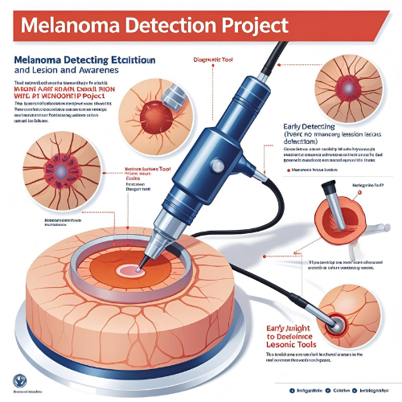

  <h1> AI-ML Projects</h1>
  <h3 style="font-weight: normal;">AI | ML | Deep Learning | GAN | NLP | EDGE-AI</h3>
    <h2>All Images are Indicative only and All trademarks and IP belong to their respective owners. </h2>

  

    <h2> Style Transfer Using GAN</h2>
    <h3> (Self Interest) </h3>
    
<strong>Domain:</strong> GAN

    
Applies Style transfer Generative Adversarial Networks.

    
      
    <!--
    
    -->
  

  

    <h2>Melanoma Detection</h2>
    <h3> (Self Interest) </h3>
    
<strong>Domain:</strong> ML, DL

    
Detection Of Melanoma using ML/DL model

    
      
    <!--
    
    -->
  

