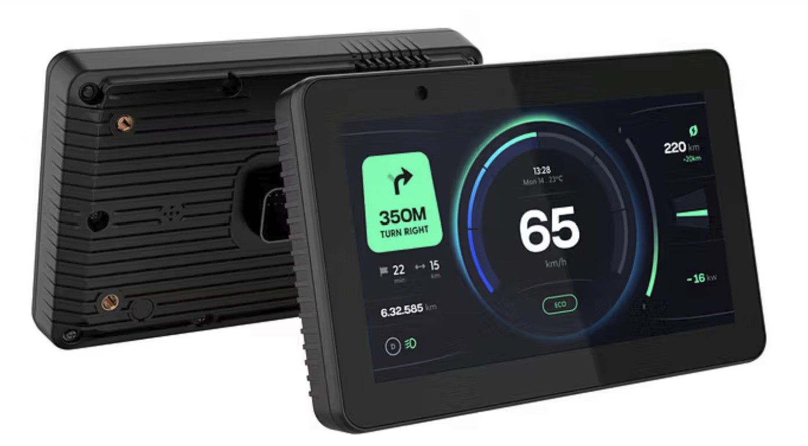
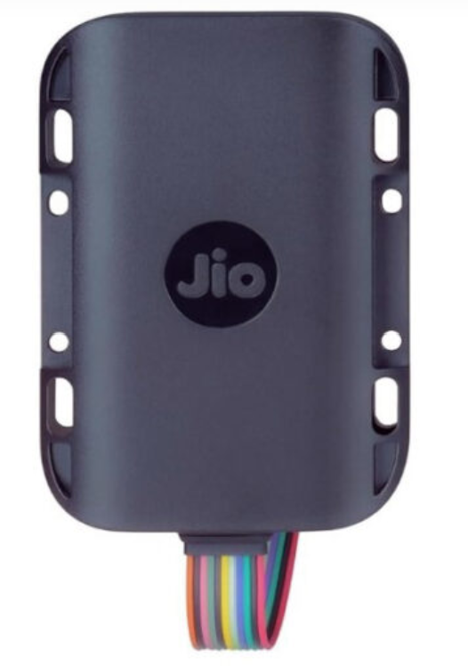

  <h1> Automotive Projects</h1>
  <h3 style="font-weight: normal;">Clusters | Vehicle Tracking </h3>
  <!-- <h3 style="font-weight: normal;">Bare Metal | RTOS | BLE | Sensors | Display | Drivers</h3>-->

  

    <h2> Android Cluster</h2>
    <h3> (Jio Platforms limited)</h3>
    
<strong>Domain:</strong> Automotive, IoT, Embedded

    
<strong>Hardware:</strong> Mediatek

    <!--
    
<strong>Language:</strong> Embedded C
 
    -->
    
Android based Cluster for 2-Wheeler targetting premium segment.

    
    
*Source: Jio Platforms official site / Times of India / Economic Times

This image is used to illustrate the product where I contributed to the product engineer. All trademarks and IP belong to their respective owners.

    

      
    <!---->
  

  

    <h2> Jio vehicle tracking</h2>
    <h3> (Jio Platforms Limited & Quest Global)</h3>
    
<strong>Domain:</strong> Embedded, IoT

    
<strong>Hardware:</strong> Quectel Module

    
<strong>Language:</strong> Embedded C (LL & HAL)

    
Tracking device for automotive secment with and Without CAN Protocol 

    
      
    
*Source: Jio Platforms official site / Amazon.in*

This image is used to illustrate the product where I contributed to the embedded firmware architecture and BLE-MQTT-LwM2M integration. All trademarks and IP belong to their respective owners.

    

    <!---->
  

  

