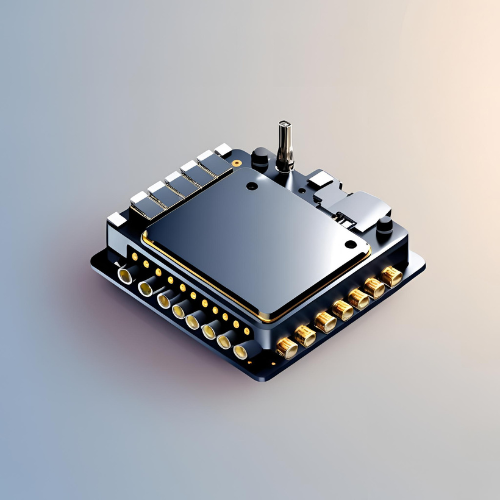
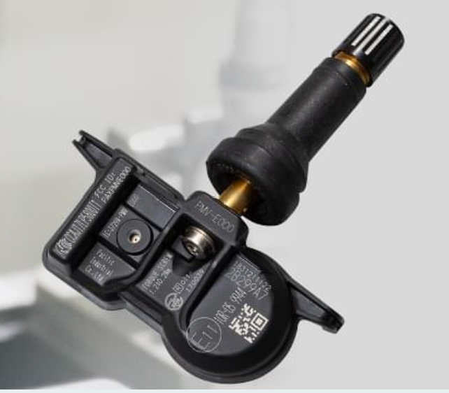
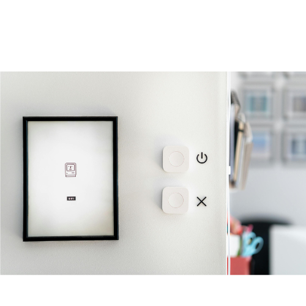
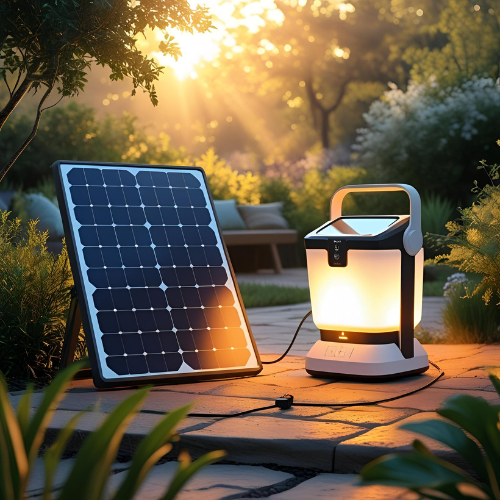
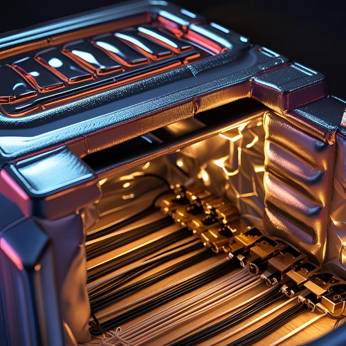

  <h1> Embedded Projects</h1>
  <h3 style="font-weight: normal;">Bare Metal | RTOS | BLE | Sensors </h3>
  <h2 All Images are Indicative only and All trademarks and IP belong to their respective owners. h2>
  <!-- <h3 style="font-weight: normal;">Bare Metal | RTOS | BLE | Sensors | Display | Drivers</h3>-->

  

    <h2> Jio Smart Android Module</h2>
    <h3> (Jio Platforms Limited)</h3>
    
<strong>Domain:</strong> Embedded, IoT (BLE)

    
<strong>Hardware:</strong> Medaitek

   <!--
    
<strong>Language:</strong> Embedded C, HAL Library 

    -->
    
JSAM is an android module specially designed for the Cluster and enfotainment application targetting Indian OEMs 

    
      
   
    <!---->
  

  
  

    <h2> Tyre Pressure Monitoring System TPMS</h2>
    <h3> (Jio Platforms Limited)</h3>
    
<strong>Domain:</strong> Embedded, IoT (BLE)

    
<strong>Hardware:</strong> Infineon, Silicon Labs

   <!--
    
<strong>Language:</strong> Embedded C, HAL Library 

    -->
    
TPMS to measure the internal Tyre Pressure and Temperature with BLE connectivity for 2-Wheeler, 3-wheeler and 4-Wheeler passenger vehicle.
    Internal and External design for retro fit 

    
      
    <!---->
  

  
  

    <h2> Home Automation System</h2>
    <h3> (EDOM Technology)</h3>
    
<strong>Domain:</strong> Bluetooth Low Energy (BLE)

    
<strong>Hardware:</strong> EFR32BGxx

    
<strong>Language:</strong> Embedded C, HAL Library 

    
BLE based <strong> Smart Switch, Smart Bulb and Door Sensor </strong> with BLE to automate the lighting system. This was the demo product based on EFR32BGxx  .

    
      
    <!---->
  

  

    <h2> Touch Switch & regulator</h2>
    <h3> (EDOM Technology)</h3>
    
<strong>Domain:</strong> Electical Switch & Regulator

    
<strong>Hardware:</strong> EFM8SB

    
<strong>Language:</strong> Embedded C, HAL Library 

    
<strong>Touch Switch and Touch Speed Regulator </strong> for Home Decor 

    
      
    <!---->
  

  

    <h2> Solar Home Lighting System</h2>
    <h3> (Aaisha Engineering Pvt Ltd)</h3>
    
<strong>Domain:</strong> Solar & Embedded

    
<strong>Hardware:</strong> Atmega8

    
<strong>Language:</strong> Embedded C, Bare-Metal 

    
Solar Home lighting System have a controller with in built battery which is used to impower the Lighting syatem and a small Dc fan. this was designed for the Indian     Indian rural area.

    
      
    <!--
    -->
  

  
  

    <h2> GPS-Rf based Off-Line Tracking System</h2>
    <h3> (Aaisha Engineering Pvt Ltd)</h3>
    
<strong>Domain:</strong>Embedded

    
<strong>Hardware:</strong> LPC214x

    
<strong>Language:</strong> Embedded C, Bare-Metal 

    
Off Line tracking device which used to audit the vehicle route and stops. Since this is for the High profile and due to risc for the hack considered Off line tracking.

    
      
    <!--
    -->
  

  

    <h2>Insulation Box</h2>
    <h3> (Aaisha Engineering Pvt Ltd)</h3>
    
<strong>Domain:</strong>Embedded

    
<strong>Hardware:</strong> Atmega8

    
<strong>Language:</strong> Embedded C, Bare-Metal 

    
 Design to prevent the fast discharging of the cell in extreme winter. It's mainitianing the constant temperature inside the box .

    
      
    <!--
    -->
  

  

    <h2>Starter Cut-off Systemx</h2>
    <h3> (Aaisha Engineering Pvt Ltd)</h3>
    
<strong>Domain:</strong>Embedded

    
<strong>Hardware:</strong> Atmega8

    
<strong>Language:</strong> Embedded C, Bare-Metal 

    
 This was design to prevenrt the Spindle of the vehicle by start abuse. it was monitoring the Temperature of the spindle and dont allow the driver to do the consecutive attempt of the start which cause the exceesuve heat generation on the spindle.

    
      
    <!--
    -->
  

  

    <h2>Automatic Starter for DG Set</h2>
    <h3> (Aaisha Engineering Pvt Ltd)</h3>
    
<strong>Domain:</strong>Embedded

    
<strong>Hardware:</strong> Atmega8

    
<strong>Language:</strong> Embedded C, Bare-Metal 

    
 This was design to prevenrt the freezing the liquid in side the DG set in the exterme winder in the J & K area. It do automatic start of the Dg ste on the preset Time for the certain time and then sut it down and this process prevent the freezing.

    
      
    <!--
    -->
  

  

